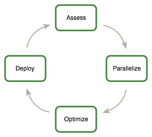

# 1. 序言

## 1.1 本文档是什么

本最佳实践指南是帮助开发人员从 NVIDIA&reg; CUDA&reg; GPUs 获得最佳性能的手册。它呈现了已经确立的并行化和优化技术，并解释了 _可以极大简化具有CUDA能力的GPU架构编程的_ 编码隐喻和习语。

尽管这些内容可以作为参考手册使用，但值得注意的是，在探索各种编程和配置主题时，有一些主题会因为上下文的不同而被重新探讨。因此，建议初学者按顺序阅读本指南。这种方法将大大提高您对有效编程实践的理解，并使您能够更好地使用本指南以供以后参考。

## 1.2 本指南适合哪些人阅读
本指南中的讨论都基于 C++ 编程语言，因此需要读者能够轻松阅读 C++ 代码。

本指南参考并依赖于其他几份文档，需要你可以随时使用它们作为参考。这些文档都可以从CUDA网站 [https://docs.nvidia.com/cuda/](https://docs.nvidia.com/cuda/) 免费获取。以下文档是特别重要的资源：
- CUDA 安装指南
- CUDA C++ 编程指南
- CUDA 工具包参考手册

需要注意的是，本指南的优化部分是在假设您已经下载并成功安装了 CUDA Toolkit (如果没有，请参阅您所在平台的相关 CUDA 安装指南)，并且需要您对CUDA C++ 编程语言和环境有基本了解（如果没有，请先阅读 CUDA C++ 编程指南）。

## 1.3 评估、并行化、优化、部署
本指南介绍了应用程序的评估、并行化、优化、部署（APOD）设计周期，旨在帮助应用程序开发人员快速识别最容易从 GPU 加速中受益的代码部分，快速实现该优势，并尽早开始在生产中利用由此带来的加速。

APOD 是一个周期性过程：只需在开始时候花费最少的时间即可实现、测试和部署初始加速，此时可以通过确定进一步的优化机会、查看额外的加速，然后将更快的应用程序版本部署到生产中来，开始新的循环。



### 1.3.1 评估
对于现有的项目，第一步是评估代码中最耗时的部分。知道了这些东西，开发人员就可以评估这些瓶颈以实现并行化，并开始研究GPU加速。

通过了解最终用户的要求和约束，并应用Amdahl定律和Gustafson 定律。开发人员可以通过加速应用程序的已识别部分来确定性能改进上线。

### 1.3.2 并行化
在确定了热点并完成了设定目标和期望的基础操作后，开发人员需要并行化代码，根据原始代码，可以很简单地调用现有的 GPU 优化库，如cuBLAS、cuFFT或者Thrust，这些库的使用像向并行编译器添加一些预处理器指令一样简单。

另一方面，某些应用程序的设计将需要一定程度的重构来暴露其固有的并行性。由于即使是CPU架构也需要公开并行性以提高或简化保持顺序应用程序的性能，因此CUDA 系列并行编程语言（CUDA C++、CUDA Fortran等）旨在使这种并行性的表达尽可能简单，同时支持在可用CUDA的GPU上运行，以实现最大的并行吞吐。

### 1.3.3 优化
在完成每一次应用程序并行化之后，开发人员可以开始优化实现以提高性能。由于可以考虑许多可能的优化，因此充分了解应用的程序的需求有助于使过程尽可能顺利。然而，与整个APOD一样，程序优化是一个迭代过程（确定优化机会，应用和测试优化，验证实现的加速，再次重复），这意味着开发者没有必要花费大量的时间记住所有可能的优化策略，然后才能看到良好的加速。相反，策略可以在学习时逐步应用。

优化可以应用于各个级别，从**重叠的数据传输与计算**一直到**微调浮点运算序列**。可用的分析工具对于指导过程非常宝贵，因为他们可以帮助开发人员的优化工作提供下一个最佳行动方案，并为本指南优化部分的相关内容提供参考。

### 1.3.4 部署
完成应用程序的一个或多个组件的GPU加速后，可以将结果和原始预期进行比较。回想一下，初始评估步骤中，开发人员通过优化给定热点，确定一个可实现的潜在加速上限。

在处理其它热点以提高整体加速之前，开发人员应考虑采用部分并行化的实现并将其带到生产中。这很重要，有很多原因，比如：允许用户尽早从他们的投资中获利（加速可能是部分的，但仍然很有价值），并且它通过为应用程序提供一组渐进式而不是革命性的更改，来最大限度地降低开发人员和用户的风险。

## 1.4 建议和最佳实践
在本指南中，对CUDA C++代码的设计和实现提出了具体建议。这些建议根据其效果和范围综合之后的优先级分类。对大多数CUDA应用程序进行实质性改进的操作具有最高优先级，而只影响非常特定情况的小型优化具有较低的优先级。

在实施较低优先级的建议之前，最好确保所有相关的高优先级的建议都已经应用。这种方式会最大化投入的回报，并避免陷入过早优化的陷阱中。

确定优先权的收益和范围标准取决于该问题的性质。在本指南中，它们代表着一个典型案例。代码可能反映不同的优先级因素。无论哪种可能，都应该在低优先级的优化之前，确认没有遗漏高优建议。

> **注意**
>
> 为了简洁，整个指南中的代码示例都省略了错误检查。但是，生产代码应该系统地检查每个API调用返回的错误代码，并调用```cudaGetLastError()```来检查内核启动中的失败。 

## 1.5 评估你的应用
从超算到手机，现代处理器越来越依赖并行性来提高性能。核心计算单元，包括控制、算术、寄存器和一般缓存，被复制一定次数并通过网络链接到内存。因此，所有现代处理器都需要并行代码才能很好地利用其计算能力。

虽然处理器正往给程序员提供更细粒度的并行性的方向发展，但许多现有的应用程序已经演变为串行代码或粗粒度的并行代码（例如，数据被分解为并行处理的区域，子区域利用MPI进行共享）。为了从一些现代处理架构（包括GPU）中获得收益，第一步是评估应用确认热点，确定它们是否可以并行化，并且了解现在和未来的相关工作量。